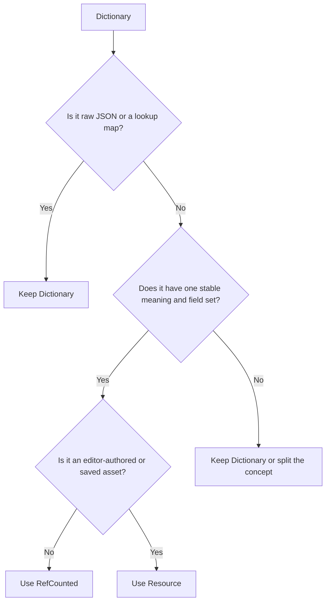
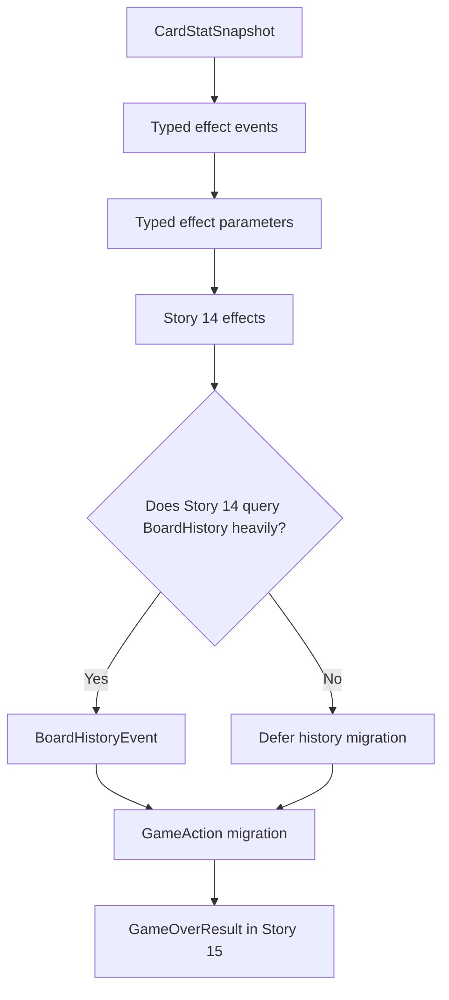

# Post-Story 13 Spike: Replacing Runtime Dictionaries with RefCounted Objects

Date audited: 2026-08-25

Status: Audit complete; migrations not yet implemented

Related: [[Story 13 Combat and Board Refill Implementation Guide]] · [[Story 13.5 Board Shift and Edge Refill Helper]] · [[Story 14 Effects Implementation Guide]] · [[Action System]] · [[Amended Implementation Story Order]]

## Purpose

Find places where production code uses a Dictionary as if it were a Java POJO and replace those stable runtime shapes with typed RefCounted classes.

The intended boundary is:

```text
raw JSON
→ Dictionary
→ validation/factory
→ typed RefCounted or Resource
→ gameplay
```

Raw JSON is allowed to be untyped. Once data enters trusted gameplay code, stable concepts should normally have typed fields.

## Java Mental Model

| Java | Godot/GDScript |
|---|---|
| Map<String, Object> | Dictionary |
| POJO, DTO, command, or event class | RefCounted class |
| Serializable editor asset | Resource |
| Component attached to the world | Node |
| Jackson/Gson mapping layer | Factory such as CardDataFactory |

RefCounted is the closest match to an ordinary Java POJO:

```gdscript
class_name DamageResult
extends RefCounted

var damageDealt: int
var wasLethal: bool
```

Godot automatically releases a RefCounted object when nothing references it anymore.

## Decision Rule



Use RefCounted when the value is:

- a command;
- an event;
- a request;
- a result;
- a context;
- a snapshot;
- a history record;
- a planned operation;
- created and discarded during gameplay.

## Audit Summary

| Candidate | Current form | Recommendation | Priority |
|---|---|---|---:|
| Generic action envelope | Dictionary | GameAction RefCounted | High, dedicated migration |
| Action-specific data | Nested Dictionary | Typed ActionPayload subclasses | High after GameAction |
| Effect events | Dictionary | GameplayEvent subclasses | High before Story 14 |
| Effect parameters from JSON | Dictionary | EffectParameters subclasses | High before Story 14 |
| Graveyard stat snapshot | Dictionary | CardStatSnapshot | High |
| BoardHistory event | Dictionary | BoardHistoryEvent | Medium |
| Future game-over payload | Not implemented | GameOverResult | High when Story 15 starts |
| JSON parser/factory input | Dictionary | Keep Dictionary | Correct boundary |
| Card/effect library maps | Dictionary | Keep typed Dictionary | Correct data structure |
| Active effects map | Dictionary | Keep typed Dictionary | Correct data structure |
| Serialization output | Dictionary | Keep Dictionary | Correct boundary |
| Test fixture bundles | Dictionary | Keep Dictionary | Local test convenience |

---

## Candidate 1: GameAction

Priority: High, but implement as its own migration

### Current code

- src/main/singletons/actions/action_object.gd
- src/main/singletons/actions/action_queue.gd
- src/main/singletons/actions/action_processor.gd
- src/main/singletons/global_signal_bus.gd
- src/main/effects/effect_context.gd
- every action producer and action test

Actions currently use a fixed Dictionary:

```gdscript
{
    "type": actionType,
    "source": source,
    "target": target,
    "data": data
}
```

This is functioning as a POJO already, but without a class.

### Problems

- Every consumer must know the exact string keys.
- The outer shape must be manually validated.
- Signals cannot declare a useful action type.
- Renaming a field requires string searches.
- Autocomplete cannot show the available fields.
- Misspelled keys are runtime bugs.
- The previous source_instance_id backtick defect demonstrated this risk.

### Proposed class

```gdscript
class_name GameAction
extends RefCounted

var type: String
var source: Variant
var target: Variant
var payload: ActionPayload

static func create(
    actionType: String,
    actionSource: Variant,
    actionTarget: Variant,
    actionPayload: ActionPayload = null
) -> GameAction:
    var action := GameAction.new()
    action.type = actionType
    action.source = actionSource
    action.target = actionTarget
    action.payload = actionPayload
    return action

func isValid() -> bool:
    return type in ActionType.VALID_TYPES
```

The queue becomes:

```gdscript
var _queue: Array[GameAction] = []

func enqueueAction(action: GameAction) -> bool:
    if action == null or !action.isValid():
        return false
    _queue.append(action)
    return true
```

Signals become:

```gdscript
signal actionEnqueued(action: GameAction)
signal actionResolved(action: GameAction, result: Variant)
```

ActionQueue can still use is_same to wait for the exact action object.

### Is this a good idea?

Yes. The action envelope is stable, crosses many systems, and has already produced key-related defects.

The migration is broad, so it should not be mixed casually into effect or combat work. Change all producers, queue APIs, processor handlers, signals, effects, UI observers, and tests in one dedicated story.

Decision: Replace with GameAction.

---

## Candidate 2: Typed Action Payloads

Priority: High after GameAction

Typing only the outer action still leaves this:

```gdscript
action.payload.get("amount")
action.payload.get("cause")
action.payload.get("source_instance_id")
```

These nested payloads have stable schemas and are the likeliest place for misspellings.

### Proposed family

```text
ActionPayload
├── DealDamagePayload
├── MoveCardPayload
├── ModifyStatsPayload
├── RemoveCardPayload
├── RevealCardPayload
└── ReviveCardPayload
```

Base class:

```gdscript
class_name ActionPayload
extends RefCounted

var cause: String = ""
```

Damage:

```gdscript
class_name DealDamagePayload
extends ActionPayload

var amount: int
var cycleNumber: int
```

Removal:

```gdscript
class_name RemoveCardPayload
extends ActionPayload

var sourceInstanceId: int
```

Modify stats:

```gdscript
class_name ModifyStatsPayload
extends ActionPayload

var stat: String
var amount: int
```

### Benefits

- No source_instance_id string to misspell.
- Amount is always an integer field.
- Required values can be validated in constructors.
- ActionProcessor can reject the wrong payload subtype.
- Payload names can be refactored safely.

### Is this a good idea?

Yes for action types with stable fields. Empty or genuinely flexible actions may use the base payload or no payload.

Decision: Convert action payloads incrementally immediately after GameAction.

---

## Candidate 3: Typed Effect Events

Priority: High before Story 14 expands the effect system

### Current code

- src/main/singletons/effects/effect_processor.gd
- src/main/effects/handlers/card_effect.gd
- src/main/effects/handlers/gain_health_on_play.gd

EffectProcessor dispatches different Dictionary shapes:

```gdscript
{"type": "on_play", "card": card}
```

```gdscript
{
    "type": "action_resolved",
    "action": action,
    "result": result
}
```

Handlers query them with event.get calls.

### Proposed family

```text
GameplayEvent
├── ActionResolvedEvent
├── CardPlayedEvent
├── CombatEndedEvent
├── BoardRefillCompletedEvent
└── PlayerCycleCompletedEvent
```

```gdscript
class_name GameplayEvent
extends RefCounted
```

```gdscript
class_name CardPlayedEvent
extends GameplayEvent

var card: Card
```

```gdscript
class_name ActionResolvedEvent
extends GameplayEvent

var action: GameAction
var result: Variant
```

CardEffect becomes:

```gdscript
func onEvent(event: GameplayEvent) -> void:
    pass
```

A handler can use subtype checks:

```gdscript
func onEvent(event: GameplayEvent) -> void:
    if !(event is CardPlayedEvent):
        return
    if event.card != hostCard:
        return
```

### Is this a good idea?

Yes. Story 14 will add more event types. One growing Dictionary with many optional keys would become fragile quickly.

Decision: Replace Dictionary effect events with RefCounted event classes.

---

## Candidate 4: Typed Effect Parameters

Priority: High before implementing the final Story 14 effects

### Current code

- src/main/effects/effect_data.gd
- src/main/effects/effect_data_factory.gd
- src/main/effects/handlers/gain_health_on_play.gd

EffectData is a Resource, but its parameters are:

```gdscript
@export var parameters: Dictionary = {}
```

GainHealthOnPlay then performs:

```gdscript
var amount = data.parameters.get("amount")
```

### Proposed family

```text
EffectParameters
├── GainHealthParameters
├── SolitaryBeastParameters
├── WaxingFerocityParameters
└── TasteOfVictoryParameters
```

```gdscript
class_name EffectParameters
extends RefCounted
```

```gdscript
class_name GainHealthParameters
extends EffectParameters

var amount: int
```

EffectDataFactory converts raw JSON:

```text
JSON parameters Dictionary
→ inspect effect type
→ validate fields
→ construct correct EffectParameters subtype
```

EffectData then stores:

```gdscript
var parameters: EffectParameters
```

### RefCounted or Resource?

If JSON remains the source of truth, use RefCounted. It is the closest match to Jackson/Gson producing a nested POJO.

If effect parameters will be created and edited inside Godot's Inspector, use Resource instead so the fields can be exported and saved as .tres assets.

The current project loads effects from JSON, so RefCounted is the simpler recommendation today.

### Is this a good idea?

Yes. Each implemented effect has a known parameter schema. Convert immediately after JSON parsing rather than letting parameter Dictionaries enter effect handlers.

Decision: Use RefCounted parameter classes while JSON remains authoritative.

---

## Candidate 5: CardStatSnapshot

Priority: High and low migration cost

### Current code

- src/main/graveyard/graveyard_entry.gd
- src/main/singletons/graveyard/graveyard.gd

GraveyardEntry contains:

```gdscript
var statSnapshot: Dictionary = {}
```

The shape is always:

```gdscript
{
    "health": card.health,
    "temporary_health": card.temporaryHealth,
    "attack": card.attack
}
```

### Proposed class

```gdscript
class_name CardStatSnapshot
extends RefCounted

var health: int
var temporaryHealth: int
var attack: int

static func fromCard(card: Card) -> CardStatSnapshot:
    var snapshot := CardStatSnapshot.new()
    snapshot.health = card.health
    snapshot.temporaryHealth = card.temporaryHealth
    snapshot.attack = card.attack
    return snapshot

func toDictionary() -> Dictionary:
    return {
        "health": health,
        "temporary_health": temporaryHealth,
        "attack": attack
    }
```

GraveyardEntry becomes:

```gdscript
var statSnapshot: CardStatSnapshot
```

Serialization still calls statSnapshot.toDictionary.

### Is this a good idea?

Yes. This is a small, fixed runtime DTO that Story 14 effects may query.

Decision: Replace the snapshot Dictionary.

---

## Candidate 6: BoardHistoryEvent

Priority: Medium

### Current code

- src/main/singletons/board_history.gd
- src/main/effects/effect_context.gd
- src/main/singletons/graveyard/graveyard.gd
- src/tests/card_test_scene.gd

BoardHistory stores:

```gdscript
var events: Array[Dictionary] = []
```

Every event has sequence and event, while the remaining fields vary.

### First-stage class

```gdscript
class_name BoardHistoryEvent
extends RefCounted

var sequence: int
var eventType: String
var details: Dictionary

func toDictionary() -> Dictionary:
    var output := details.duplicate(true)
    output["sequence"] = sequence
    output["event"] = eventType
    return output
```

This types the common envelope while leaving genuinely variable details flexible.

### Possible later subclasses

```text
BoardHistoryEvent
├── CardRemovedHistoryEvent
├── CardDeletedHistoryEvent
└── CardRevivedHistoryEvent
```

Only add subclasses if gameplay effects repeatedly query their detail fields.

### Is this a good idea?

Typing the envelope is reasonable. Typing every event subtype now may be premature.

Decision: Introduce BoardHistoryEvent if Story 14 reads history directly. Keep details as a Dictionary until repeated access proves another typed class is useful.

---

## Candidate 7: GameOverResult

Priority: High when Story 15 starts

Do not create a game-over Dictionary first and migrate it later.

```gdscript
class_name GameOverResult
extends RefCounted

enum Reason {
    PLAYER_DEFEATED,
    JOURNEY_DECK_EXHAUSTED
}

var reason: Reason
var cycleNumber: int
var finalCombat: CombatResult
```

Expected signal:

```gdscript
signal gameOver(result: GameOverResult)
```

### Is this a good idea?

Yes. The game and UI need one authoritative outcome with a fixed set of fields.

Decision: Start Story 15 with a typed RefCounted result.

---

## Existing RefCounted Classes That Are Already Correct

Story 13 already demonstrates the intended pattern:

- CombatContext
- DamageResult
- CombatResult
- BoardRefillRequest
- BoardRefillResult
- GraveyardEntry

Story 13.5 plans:

- BoardShiftPlan
- BoardShiftStep

These are already POJO-like typed runtime objects. They should remain RefCounted.

## Dictionaries That Should Not Become RefCounted Objects

Not every Dictionary is a hidden POJO.

### Raw JSON

Keep Dictionaries in:

- CardJsonLoader
- EffectJsonLoader
- CardDataFactory input
- EffectDataFactory input

JSON is dynamic at the untrusted input boundary. Factories should validate it and construct typed objects.

### Lookup maps

Keep:

```gdscript
CardLibrary.cardDataById
EffectLibrary.effectDataById
EffectProcessor.activeEffectsByCard
```

These are real maps, equivalent to Java Map<K, V>.

Where supported, strengthen their value types:

```gdscript
var cardDataById: Dictionary[String, CardData] = {}
var effectDataById: Dictionary[String, EffectData] = {}
```

### Serialization

Keep Dictionary output for:

- toDictionary methods;
- JSON saves;
- debug display;
- external logging.

The correct direction is:

```text
typed runtime object
→ toDictionary
→ serialization
```

Do not query serialized Dictionaries as the main runtime API.

### Local test fixtures

Test setup helpers return small fixture Dictionaries containing a grid, board, cards, and controllers. These are local and do not cross production boundaries. A fixture class would add little value.

## Resource Usage in This Project

CardData and EffectData already extend Resource. That is acceptable because they represent reusable game definitions.

However, Resource is not required merely to convert JSON into a typed object. If an object:

- is created only at runtime;
- is never edited in the Inspector;
- is never saved as a .tres file; and
- behaves like a Java DTO;

then RefCounted is the clearer choice.

```text
Runtime POJO/DTO      → RefCounted
Godot data asset      → Resource
Scene/world component → Node
Dynamic map           → Dictionary
```

## Recommended Migration Stories

### Migration A: Effect contracts

Do before Story 14:

1. Add GameplayEvent and concrete event subclasses.
2. Change CardEffect.onEvent to accept GameplayEvent.
3. Add EffectParameters subclasses.
4. Convert JSON parameter Dictionaries in EffectDataFactory.
5. Update existing effect handlers and tests.
6. Remove the Dictionary event and runtime parameter paths.

### Migration B: Graveyard snapshot

Can be completed independently:

1. Add CardStatSnapshot.
2. Change GraveyardEntry.statSnapshot.
3. Preserve toDictionary output.
4. Update Graveyard and its tests.

### Migration C: GameAction and payloads

Complete as a dedicated system-wide migration:

1. Add GameAction and ActionPayload.
2. Add payload subclasses.
3. Change ActionQueue to Array[GameAction].
4. Change ActionProcessor handlers.
5. Type action signals.
6. Change every producer and observer.
7. Update action, combat, refill, effect, deck, and UI tests.
8. Remove ActionType.make returning Dictionary.
9. Do not leave both action representations active.

### Migration D: BoardHistory

Make the final decision when Story 14's history queries are known.

### Migration E: Game over

Create GameOverResult as part of Story 15 before adding its signal or UI.

## Recommended Order



## Tests Required

### GameAction

- Construction rejects unknown action types.
- The queue accepts only GameAction.
- Queue order remains unchanged.
- Waiting matches the exact GameAction instance.
- Every current action returns the same result type as before.
- Action signals expose GameAction.

### Action payloads

- Each action accepts only its expected payload subtype.
- Required fields are validated during construction.
- Wrong payload types fail without mutating game state.
- Cause, cycle, and stable attribution survive processing.

### Effect events and parameters

- Every event exposes only its valid fields.
- Handlers ignore unrelated event subclasses safely.
- JSON creates the correct EffectParameters subtype.
- Missing and invalid fields fail validation or receive documented defaults.
- No runtime event or parameter Dictionary remains.

### CardStatSnapshot

- All values are copied from the card.
- Later card changes do not alter the snapshot.
- Graveyard serialization keeps its existing JSON/debug shape.

### BoardHistoryEvent

- Sequence ordering and filtering remain correct.
- Returned history cannot mutate stored history.
- toDictionary preserves current output.

## Final Recommendation

Your Java instinct applies well here:

> When a Dictionary has a known name, stable fields, and multiple consumers, treat it like a Map<String, Object> that wants to become a POJO.

In this project, replace the action envelope, stable action payloads, effect events, effect parameters, Graveyard stat snapshots, and future game-over payload with typed RefCounted classes.

Consider a typed BoardHistory envelope once its gameplay queries are clear.

Keep Dictionaries for raw JSON, genuine lookup maps, serialization, and local test bundles.

## Definition Of Done

- [x] Production Dictionary boundaries have been audited.
- [x] RefCounted candidates have been identified.
- [x] Resource and RefCounted responsibilities are distinguished.
- [x] Dictionaries that should remain are documented.
- [x] Migration groups and ordering are documented.
- [ ] CardStatSnapshot is implemented.
- [ ] Typed effect events are implemented.
- [ ] Typed effect parameters are implemented.
- [ ] GameAction and typed payloads are implemented.
- [ ] BoardHistory decision is confirmed against Story 14.
- [ ] GameOverResult is implemented with Story 15.
- [ ] All affected tests pass after each migration.
