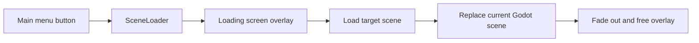

# Screen System Organisation and Practices

Date noted: 2026-09-03

Related: [[Action System]] · [[Amended Implementation Story Order]]

Reference: [Spire Codex repository](https://github.com/ptrlrd/spire-codex). Its useful organisational pattern is to keep full pages separate while placing reusable interface pieces in a shared component area. This note adapts that idea for Pilgrimage's Godot project.

## Core Principle

Use **screen** for a player-facing destination and **component** for a reusable piece of interface.

```text
Screen    = a full destination: Main Menu, Settings, Main Game, Game Over
Overlay   = temporarily sits above a screen: Loading, Pause, Confirmation Dialog
Component = reusable interface piece: button, slider, progress bar, card tooltip
```

Godot still calls `.tscn` files “scenes”; that is engine terminology. In Pilgrimage's names and folders, call player-facing destinations `screens` so their purpose is clear.

## Recommended Folder Layout

```text
src/main/
  screens/
    main_menu/
      main_menu.tscn
      main_menu.gd
    settings/
      settings_screen.tscn
      settings_screen.gd
    game/
      game_screen.tscn
      game_screen.gd
    game_over/
      game_over_screen.tscn
      game_over_screen.gd

  ui/
    components/
      primary_button.tscn
      primary_button.gd
      setting_row.tscn
      setting_row.gd
      progress_bar.tscn
      progress_bar.gd
    overlays/
      loading_screen.tscn
      loading_screen.gd
      pause_menu.tscn
      pause_menu.gd
      confirmation_dialog.tscn
      confirmation_dialog.gd
    themes/
      pilgrimage_theme.tres
```

Keep a scene and its script together. Do not put every `.tscn` in one folder and every `.gd` in another: a feature is easier to find, move, and delete when its files live together.

`src/main/screens/menus/` can remain temporarily, but prefer `screens/main_menu/` once the menu grows beyond one file. Rename the current `scene loading` folder to `screens/loading/` when it is safe to do a focused rename. Use `loading_screen`, not `loading_screne`.

## Screen Ownership

| Area | Owns | Must not own |
|---|---|---|
| `main_menu` | Start, settings, quit button behaviour | Run/gameplay state |
| `settings` | Controls and editing saved preferences | Direct audio/rendering implementation details |
| `game` | Composition of the board, deck, HUD, and game-specific UI | Core rules and action processing |
| `game_over` | Showing the final result and restart/menu choices | Deciding whether the run ended |
| `ui/components` | Local display behaviour and user input signals | Screen navigation or gameplay mutation |
| `ui/overlays` | Temporary modal presentation | Becoming a second game-state authority |
| `SceneLoader` | Transition lifecycle and loading progress | Menu/game rules or button-specific decisions |

The `GameController` remains the source of truth for gameplay state. A screen observes it and presents that state; it should not quietly duplicate the rules.

## Navigation and Transition Flow

Keep one owner for full-screen changes. Pilgrimage already has a `SceneLoader` autoload; let it remain the transition boundary.



Useful rules:

- Screens request a target; only `SceneLoader` changes the active Godot scene.
- The loading screen is an overlay, not the next full screen.
- The transition animation must use one exact name everywhere. The current project uses `screenTransition`; do not call it `sceneTransition` elsewhere.
- Connect signals for a transition once, then disconnect or free the temporary overlay so old screens cannot receive future events.
- Let a failed asynchronous load produce an error state or return to the initiating screen; never leave an opaque black overlay on screen.

## Reusable UI Practices

Build a shared component only when the same behaviour or look appears in at least two places. Until then, keep it local to the screen.

Good early shared components:

- `primary_button`: common focus, disabled, hover, and press presentation;
- `setting_row`: label plus one control such as a slider, checkbox, or option button;
- `progress_bar`: loading or long action progress;
- `modal_panel`: the visual shell for pause, confirmation, and game-over panels;
- `toast` or notification: a brief non-blocking message.

Each component should expose a small interface:

```text
Input:   exported properties and explicit methods
Output:  a small number of signals, such as pressed or value_changed
Hidden:  its child-node layout and visual implementation
```

For example, `SettingRow` can emit `value_changed(new_value)`. The Settings screen decides which saved preference to update; `SettingRow` should not know the name of a global setting.

## UI, Signals, and Gameplay Actions

There are two different communication paths:

```text
UI button → requests navigation or a gameplay action
Gameplay/action result → signal or model update → UI refreshes presentation
```

Follow these boundaries:

- A HUD may observe `GlobalSignalBus` or a presentation model to update text, bars, and animations.
- A UI element may request a gameplay action through the existing action boundary when the player intends a game change.
- A signal must not become a hidden second way to mutate board or combat state.
- A screen must not calculate combat, deck refill, or game-over rules itself.

This keeps the game testable without its UI and lets UI change without rewriting the rules layer.

## Suggested First Delivery Order

1. Stabilise `loading_screen` and `SceneLoader`; prove a transition to and from a small test screen.
2. Build `main_menu` with Play, Settings, and Quit. Keep the Play destination configurable.
3. Add a small `settings_screen` and one real persisted setting, end to end.
4. Assemble `game_screen` from the existing board/deck/game-controller systems.
5. Add a pause overlay, without unloading the game screen.
6. Add a typed game-over result from the gameplay layer, then use it to populate `game_over_screen`.
7. Extract repeated UI into `ui/components` only after it has appeared more than once.

## Definition of Done for Each Screen

- The screen has one clear owner and a focused script.
- Its scene and script sit in the same feature folder.
- It uses shared components where an established one already fits.
- It exposes no direct duplicate path for gameplay mutation.
- Keyboard/controller focus starts somewhere sensible.
- Escape/back has an intentional result.
- Screen transitions cannot strand the player behind a black loading overlay.
- It has a quick manual test path, and non-visual logic has an automated test where practical.

## Avoid Early Over-Engineering

Do not build a universal router, generic modal framework, or a large UI event bus before the first two or three screens reveal what they actually share. Begin with simple direct calls to `SceneLoader`, local screen scripts, and a few well-defined shared components. Extract an abstraction only when repeated work proves its shape.
