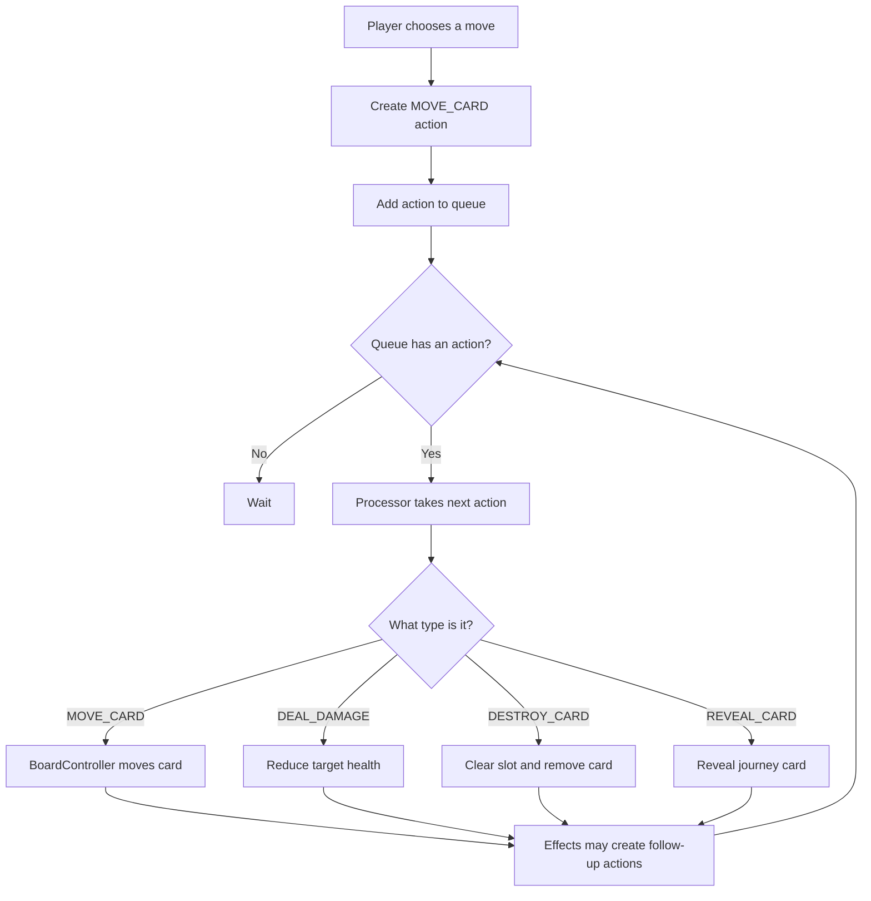

# The Action System, Explained Simply

Date: 2026-07-13

## The Whole Idea in One Sentence

Instead of game objects changing the game directly, they write down what they want to happen; the action system reads those requests one at a time and performs them.

That is the entire idea.

```text
WITHOUT AN ACTION SYSTEM

Card ───────────────► changes another card immediately


WITH AN ACTION SYSTEM

Card ─► writes a request ─► request waits in line ─► processor performs it
```

The extra steps may initially look unnecessary. They become valuable when several events must happen in the correct order, or effects need a chance to react.

## A Real-World Analogy: A Restaurant

Imagine a restaurant:

- The **customer** decides what they want.
- The **order ticket** describes what they want.
- The **ticket rail** holds orders in sequence.
- The **chef** reads and performs one order at a time.

In the game:

| Restaurant | Action system |
| --- | --- |
| Customer | Card, player, effect, or game rule |
| Order ticket | Action dictionary |
| Ticket rail | Action queue |
| Chef | Action processor |
| Finished meal | Changed game state |

The customer does not walk into the kitchen and cook the meal. In the same way, a card should eventually avoid reaching into many other systems and changing them directly. It submits an action.

```text
               “Deal 3 damage to the monster”

  CARD             ACTION             QUEUE            PROCESSOR
┌────────┐       ┌────────────┐      ┌──────────┐      ┌───────────┐
│ Player │──────►│ DealDamage │─────►│ waiting  │─────►│ apply the │
│ attack │       │ amount: 3  │      │ actions  │      │ damage    │
└────────┘       └────────────┘      └──────────┘      └─────┬─────┘
                                                            │
                                                            ▼
                                                   Monster loses 3 health
```

## The Four Pieces

The full system has four concepts. Do not try to make any one piece do all four jobs.

### 1. The requester decides what should happen

The requester might be:

- player input;
- a card;
- a card effect;
- combat rules;
- the journey deck; or
- game setup.

Its job is to decide intent: “this card should move” or “that monster should take damage.”

It creates an action instead of performing the change itself.

```gdscript
var action := ActionTypes.make(
	ActionTypes.DEAL_DAMAGE,
	attackingCard,
	targetCard,
	{"amount": 3},
)
```

This code has not damaged anything. It has only described a request.

### 2. The action describes the request

An action is just a small dictionary:

```gdscript
{
	"type": "deal_damage",
	"source": attackingCard,
	"target": targetCard,
	"data": {"amount": 3},
}
```

Read it like a sentence:

```text
TYPE             SOURCE          TARGET          DATA
Deal damage  +   from attacker + to target    + amount is 3

                   ↓

“The attacking card deals 3 damage to the target card.”
```

Each field answers one question:

| Field | Question | Example |
| --- | --- | --- |
| `type` | What should happen? | `DEAL_DAMAGE` |
| `source` | Who or what caused it? | Attacking card |
| `target` | Who or what receives it? | Monster card |
| `data` | What extra details are needed? | `amount: 3` |

The `source` and `target` can sometimes be `null`. For example, a `GAME_OVER` action may not need a target. The exact requirements depend on the action type.

### 3. The queue keeps requests in order

The action queue is a waiting line. New actions join the back. The next action comes from the front.

```text
FRONT — processed next                              BACK — added last

┌────────────────┐  ┌────────────────┐  ┌────────────────┐
│ 1. MOVE_CARD   │  │ 2. DEAL_DAMAGE│  │ 3. DRAW_CARD   │
└───────┬────────┘  └────────────────┘  └────────────────┘
        │
        ▼
   Processor
```

This is called **first in, first out**, or FIFO. It simply means the first request added is the first request performed.

The queue does not:

- move cards;
- calculate damage;
- decide whether the player wins; or
- run effects.

It only stores valid actions in a predictable order.

### 4. The processor performs the request

The processor takes the next action and chooses the matching handler:

```gdscript
match action["type"]:
	ActionTypes.MOVE_CARD:
		_handleMoveCard(action)
	ActionTypes.DEAL_DAMAGE:
		_handleDealDamage(action)
	ActionTypes.DESTROY_CARD:
		_handleDestroyCard(action)
```

This is the point where the game actually changes.

```text
Action says MOVE_CARD
          │
          ▼
Processor checks the destination
          │
          ▼
BoardController moves the card
          │
          ▼
The game board is now different
```

The processor does not decide why the move was requested. It only knows how to carry out a valid move request.

## One Complete Pilgrimage Example

Suppose the player moves onto a monster. The monster takes damage, dies, and the old space is refilled from the journey deck.

The desired sequence is:

```text
1. Move player
2. Deal damage to monster
3. Destroy monster if its health reaches zero
4. Reveal a journey card in the empty space
```

### Step 1: A rule creates the first action

The movement rule creates a request:

```gdscript
var moveAction := ActionTypes.make(
	ActionTypes.MOVE_CARD,
	playerCard,
	destinationSlot,
)

ActionQueue.enqueueAction(moveAction)
```

Nothing moves during `make()`. The request is merely created and added to the queue.

### Step 2: The queue holds it

```text
QUEUE
┌─────────────────────────────────────┐
│ MOVE_CARD                           │
│ source: playerCard                  │
│ target: destinationSlot             │
└─────────────────────────────────────┘
```

### Step 3: The processor performs it

The processor removes `MOVE_CARD`, recognizes its type, and calls the board controller. The board controller owns the low-level placement rules.

```text
ActionProcessor
      │
      │ “Please carry out MOVE_CARD”
      ▼
BoardController
      │
      │ checks and changes slots
      ▼
Game board
```

The responsibilities remain separate:

- Action: describes the move.
- Queue: controls when it happens.
- Processor: chooses how it is resolved.
- Board controller: performs safe board operations.

### Step 4: More actions can be added

Combat or effects can add follow-up actions:

```text
Before processing:                 After MOVE_CARD:

┌──────────────┐                  ┌──────────────┐
│ MOVE_CARD    │                  │ DEAL_DAMAGE  │
└──────────────┘                  ├──────────────┤
                                  │ DESTROY_CARD │
                                  ├──────────────┤
                                  │ REVEAL_CARD  │
                                  └──────────────┘
```

The processor continues one action at a time until the queue is empty.



If your Markdown viewer does not render Mermaid, the same loop is:

```text
Create request
      │
      ▼
Add to queue ◄─────────────────────────┐
      │                                │
      ▼                                │
Processor takes next action            │
      │                                │
      ▼                                │
Perform the matching change            │
      │                                │
      ▼                                │
Effects may add more requests ─────────┘
      │
      ▼
Stop when queue is empty
```

## Why Not Just Call the Method Directly?

For one simple event, direct calls are easy:

```gdscript
targetCard.health -= 3
```

The trouble starts when the game gains reactions:

- the target has armour;
- an effect doubles incoming damage;
- another card reacts whenever damage is dealt;
- reaching zero health must destroy the card;
- destruction triggers a reward;
- the board must refill afterward; and
- animations must finish in a sensible order.

With direct calls, those rules tend to become nested:

```text
Attack calls damage
  └─ damage calls armour
       └─ damage calls death check
            └─ death calls destruction
                 └─ destruction calls reward
                      └─ destruction calls board refill
```

Soon, changing one part unexpectedly breaks another part.

With actions, the result becomes a visible sequence:

```text
1. DEAL_DAMAGE
2. MODIFY_STATS       ← armour or another effect can add this
3. DESTROY_CARD       ← added only if health reaches zero
4. DRAW_CARD
5. REVEAL_CARD
```

The sequence can be inspected, logged, tested, paused for animation, or modified by effects.

## What the Action System Achieves

### Predictable order

Events happen one at a time in queue order. This prevents several systems from changing the same card in the middle of each other's work.

### One place for gameplay changes

The processor becomes the main gate through which gameplay changes pass. When damage is wrong, there is one damage handler to inspect.

### Effects can react cleanly

The future effect mediator can inspect an action before and after it resolves:

```text
                 BEFORE                RESOLVE               AFTER
Action ─────► effects may modify ─────► perform action ─────► effects may react
```

Examples:

- Before damage: armour reduces `amount` from 3 to 2.
- After damage: a thorns effect creates a new damage action.
- After destruction: a reward effect creates a draw action.

### Easier debugging

Instead of wondering which script changed a card, log the queue:

```text
Enqueued: DEAL_DAMAGE, source=Player, target=Wolf, amount=3
Resolved: DEAL_DAMAGE
Enqueued: DESTROY_CARD, target=Wolf
```

### Easier testing

Tests can create one action, process it, and inspect the result. They do not need to reproduce every input gesture or animation that would normally cause it.

### Animation can be added later

The processor can wait until an animation completes before taking the next action. The rules still produce the same ordered requests.

## The Most Important Boundaries

These boundaries keep the design understandable:

| Part | It should do | It should not do |
| --- | --- | --- |
| `ActionTypes` | Define names, create actions, validate the shared shape | Execute actions |
| `ActionQueue` | Store valid actions in FIFO order | Decide outcomes or mutate cards |
| `ActionProcessor` | Take actions and route them to handlers | Invent player intent |
| `BoardController` | Safely place, move, and clear board objects | Manage the action timeline |
| Effect mediator | Inspect, modify, cancel, or react to actions | Become a second action processor |

When confused about where code belongs, ask:

```text
Is it describing WHAT is requested?      → Action
Is it deciding WHEN it happens?          → Queue
Is it deciding HOW it is resolved?       → Processor
Is it performing a safe board operation? → BoardController
Is it reacting to another event?         → Effect system
```

## What an Action Is Not

An action is not:

- a card animation;
- a card state such as `IN_SLOT`;
- a direct function call;
- the result of an event;
- a permanent history record; or
- a complete object containing all game logic.

It is a short-lived description of one requested gameplay change.

## Action Types Versus Signals

These concepts are easy to mix up.

An **action** asks the game to do something:

```text
“Deal 3 damage.”
```

A **signal** announces that something happened:

```text
“The board state changed.”
```

```text
ACTION                               SIGNAL
Request / command                    Announcement / notification
Usually before the change            Usually during or after the change
Processor consumes it                Interested listeners receive it
“Move this card”                     “A card was moved”
```

Signals are useful for visuals, sound, debug UI, and observers. Actions are useful for requesting ordered gameplay changes. A signal should not quietly become a second path that performs the same gameplay mutation.

## Action Types Versus Card States

A card state describes what a card is currently doing or where it is:

```text
DRAGGING, ON_BOARD, IN_SLOT
```

An action requests a change:

```text
MOVE_CARD, MODIFY_STATS, DESTROY_CARD
```

The action may cause a card state transition, but they are not the same thing.

```text
MOVE_CARD action
      │
      ▼
Processor resolves movement
      │
      ▼
Card enters its correct IN_SLOT state
```

## A Small Mental Model to Remember

Remember these four words:

```text
WRITE  →  WAIT  →  READ  →  CHANGE
```

```text
WRITE    A caller writes an action.
WAIT     The action waits in the queue.
READ     The processor reads the next action.
CHANGE   The matching handler changes the game.
```

Or remember the restaurant version:

```text
CUSTOMER  →  TICKET  →  RAIL  →  CHEF
caller       action      queue     processor
```

If you can remember that flow, you understand the action system.

## How Stories 6–10 Build It Gradually

```text
STORY 6          STORY 7          STORY 8             LATER EFFECTS
Vocabulary  ──► Waiting line ──► Execution engine ──► Reactions

ActionTypes      ActionQueue      ActionProcessor      EffectMediator
```

- Story 6 defines what an action looks like and gives every action a shared name.
- Story 7 creates the FIFO waiting line.
- Story 8 creates the processor that performs each action.
- Later stories let effects inspect and react to those actions.

Story 6 can feel abstract because it intentionally changes nothing on screen. It creates the vocabulary and envelope that the next systems rely on. It is like agreeing on the shape of restaurant tickets before building the ticket rail and opening the kitchen.

## Quick Self-Check

If the answers below make sense, the core design has landed:

1. Does `ActionTypes.make()` move a card?  
   **No. It only creates a description of the requested move.**

2. Does `ActionQueue` deal damage?  
   **No. It only keeps actions in order.**

3. Which part actually changes health?  
   **The action processor's damage handler.**

4. Why store `source`?  
   **So rules and effects know who or what caused the action.**

5. Why use a queue instead of immediately processing every request?  
   **To preserve a predictable order and avoid deeply nested changes.**

6. Can processing one action create another action?  
   **Yes. The new action joins the queue and waits its turn.**

7. What happens when the queue becomes empty?  
   **The processor waits until another gameplay request is added.**

## Final Summary

The action system turns gameplay into an orderly list of small requests.

```text
Something wants a change
          ↓
It creates an action describing the change
          ↓
The queue saves its place
          ↓
The processor performs it
          ↓
Effects may add more actions
          ↓
The loop ends when the queue is empty
```

It achieves predictable ordering, clearer ownership, easier effects, easier debugging, and safer growth. Its purpose is not to make a tiny game more complicated. Its purpose is to stop a growing game from becoming a web of scripts that change one another in surprising ways.
