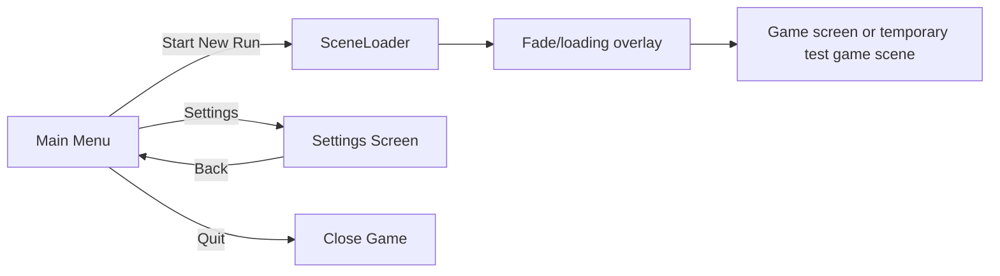

# Story: Basic Robust Menu System

Date: 2026-09-07

Status: Ready for implementation

Related: [[Screen System Organisation and Practices]] · [[Future Story - Revival Presentation and Placement]]

## Goal

Turn the current visually rich menu and the old project's complete button/navigation behaviour into one small, reliable menu system.

The player can start a new run, open Settings, and quit. Scene changes use the current threaded `SceneLoader` and its fade overlay. A repeated click or failed load must not leave the player on a black screen or start two transitions.

This story deliberately does **not** implement save/load or a pause menu. The visible `Continue` and `Load Game` buttons must not appear enabled until those systems exist.

## Player Flow



## What We Keep From Each Version

### Current branch

- The rain background, animated title, and button hover/press feedback.
- `SceneLoader` as the one place that performs scene replacement.
- The loading overlay and threaded Godot resource loading.
- A configurable Start destination rather than a destination hidden in a button callback.

### Pilgrimage-old

- Every displayed active button has a real action.
- Start, settings/character selection, and quit are separate, obvious actions.
- Navigation is blocked while a transition is already in progress.
- Screens return to the main menu through the same transition route.

## Scope

### 1. Main menu screen

Rename and organise the current menu as a dedicated feature:

```text
src/main/screens/main_menu/
  main_menu.tscn
  main_menu.gd
```

It should remain the project main scene and retain the current presentation.

The screen owns only button behaviour:

- **Start New Run** requests the configured gameplay destination from `SceneLoader`.
- **Settings** requests `settings_screen.tscn` from `SceneLoader`.
- **Quit** calls `get_tree().quit()` after checking that no transition is active.

For this delivery, remove `Continue` and `Load Game`, or show them disabled with an explicit `Coming soon` label. Do not give a player buttons which appear usable but do nothing.

### 2. Settings screen

Create a small, working settings screen:

```text
src/main/screens/settings/
  settings_screen.tscn
  settings_screen.gd
```

It needs:

- a title;
- one real setting that persists between game launches (for example, master-volume preference); and
- a Back button which returns to the main menu through `SceneLoader`.

The setting screen owns editing a preference, not audio-system implementation or gameplay state.

### 3. SceneLoader hardening

`SceneLoader` remains an autoload and the only code allowed to replace a full Godot scene.

Add a clear transition state, for example `is_loading`, and expose a small query method such as `is_loading_scene()`.

Required behaviour:

1. A screen asks to load a target.
2. If loading is already under way, ignore the additional request and return a failure/result value or log a clear message. Do not queue menu clicks in this first version.
3. Validate that the target can be requested before displaying the overlay.
4. Add the loading overlay and fade it in.
5. Start threaded loading and report progress to the overlay.
6. When loading succeeds, replace the current scene, then fade and free the overlay.
7. When loading fails or is invalid, stop processing, fade/free the overlay, clear the loading state, and report the error. The initiating menu must remain usable.

The transition state must always be cleared, including every error path.

### 4. Loading overlay

Move and rename the existing overlay when making the focused screen-folder cleanup:

```text
src/main/ui/overlays/
  loading_screen.tscn
  loading_screen.gd
```

Keep the existing fade animation but correct the `loading_screne` spelling. The overlay should own only visual transition/progress presentation. It must not decide which scene comes next.

Connect overlay callbacks for one transition only. They must be disconnected when the overlay is freed, or be safely scoped to the overlay instance, so a later transition cannot call an old screen.

## Acceptance Criteria

- Launching the project opens the main menu.
- Start New Run changes to the configured gameplay/test scene with a fade; it does not freeze the game thread while the scene resource loads.
- Settings opens a real settings screen, changes one persisted value, and Back returns to the main menu.
- Quit closes the application when run outside the editor.
- Continue and Load Game are absent or visibly disabled; neither is a dead active button.
- Double-clicking Start, pressing several menu actions quickly, or trying navigation while loading causes at most one scene transition.
- A missing/invalid destination logs a useful error, removes the loading overlay, and leaves the menu interactive.
- Returning from Settings uses `SceneLoader`; no screen directly calls `change_scene_*`.
- Mouse, keyboard, and controller focus have an intentional initial target. Escape/Back returns from Settings to the main menu.
- The current menu visuals and button effects still work after the folder rename.

## Manual Test Checklist

1. Launch the project: main menu is visible and Start has focus.
2. Hover, keyboard-focus, and press every active button: feedback works and each button has exactly one action.
3. Press Start repeatedly during the fade: one load occurs and one overlay disappears afterward.
4. Open Settings, change the setting, return, restart the project, and confirm the setting remains.
5. Temporarily set Start to an invalid scene path/UID: confirm an error is reported, the overlay disappears, and the menu is still usable. Restore the valid destination after the test.
6. Build/run outside the editor and verify Quit closes the game.

## Concerns and Decisions Needed

### The current Start target is a test scene

It currently points to `src/tests scenes/card_test_scene.tscn`. This is acceptable as a temporary destination, but the story should name the real gameplay screen before release. Do not silently make the menu depend on a test scene forever.

### Continue and Load Game have no underlying save contract

There is no demonstrated save-slot, run-state serialisation, or load validation system in this branch. Implementing those buttons now would create a misleading menu and a much larger feature. Keep them disabled or remove them until a separate save/load story exists.

### Concurrent loads are currently unsafe

The current `SceneLoader` has one mutable `scenePath`, `progress`, and loaded resource but no in-progress guard. Two requests can overwrite each other or leave multiple loading overlays attached. The guard/error cleanup is the most important robustness work in this story.

### Failure cleanup is incomplete

If `load_threaded_request` fails to start, or the threaded load returns an invalid/failed status, the current overlay does not have a guaranteed exit path. This must be solved before routing multiple screens through the loader.

### Folder renames can break Godot references

Moving `.tscn` and `.gd` files changes `res://` paths. Make the rename through Godot's FileSystem dock where possible, or update every reference in the same commit and open the project to verify there are no missing-resource errors.

### A settings screen needs a deliberate persistence home

Use a small dedicated preferences autoload or `ConfigFile` stored under `user://`. Do not put preferences in `GameConstants`, which is gameplay configuration rather than player-owned saved data.

### Do not overbuild navigation yet

This needs a guarded loader and direct screen requests, not a universal route table, generic screen stack, or second UI event bus. Extract those only if more screens make repeated navigation rules unavoidable.

## Out of Scope

- Continue/load-game behaviour and save slots.
- Pause menu.
- Game-over routing and presentation.
- Replacing current gameplay/test scene composition.
- A general UI component library beyond reusing the existing button-effect behaviour.

## Suggested Implementation Order

1. Harden and manually test `SceneLoader`, including failure cleanup.
2. Rename/move the menu and loading overlay in one focused reference-safe change.
3. Wire Start and Quit; remove or disable unsupported buttons.
4. Add the minimal persisted Settings screen and Back navigation.
5. Run the manual checklist and resolve any missing-resource or transition-cleanup errors.
