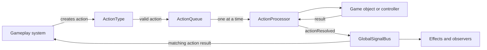
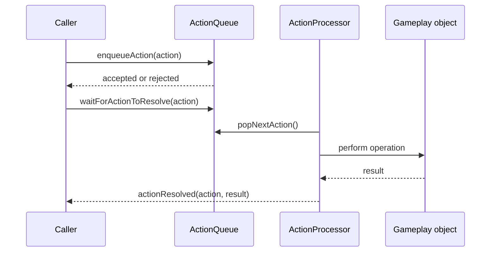

# Action System

Related: [[Combat System]] · [[Action System Explained Simply]] · [[Action Processor Delegation Principle]]

## What It Does

The action system is the game's shared pipeline for changing gameplay state.

Instead of moving a card or dealing damage immediately, gameplay code creates a small action request and places it in a queue. The queue processes requests one at a time, and the caller can wait for the exact result.

This gives combat, effects, decks, and other systems one predictable way to perform gameplay operations.

## The Action Shape

Every action is a Dictionary with four parts:

| Part | Meaning |
|---|---|
| type | What should happen |
| source | Who or what caused it |
| target | What receives it |
| data | Extra information such as amount or cause |

Example:

```gdscript
var action = ActionType.make(
    ActionType.DEAL_DAMAGE,
    attacker,
    defender,
    {
        "amount": 3,
        "cause": "combat",
        "cycle_number": 4
    }
)
```

## Main Flow



## Who Owns What?

| Part | Responsibility |
|---|---|
| ActionType | Defines valid action names and creates the shared envelope |
| ActionQueue | Validates, stores, and releases actions in order |
| ActionProcessor | Delegates each action to the correct gameplay operation |
| GlobalSignalBus | Announces enqueue, pop, and resolution events |
| Gameplay systems | Create actions and decide what their results mean |

The queue does not know how combat, cards, decks, or the board work. It only controls ordering.

The processor does not decide why an action should happen. It performs the requested operation and returns its result.

## Processing One Action



The wait helper compares the exact action Dictionary by identity. An unrelated action may resolve first without waking the wrong caller.

## Current Action Types

| Action | Typical result |
|---|---|
| REVEAL_CARD | The revealed Card, or null |
| MOVE_CARD | true or false |
| MODIFY_STATS | No result |
| DEAL_DAMAGE | DamageResult |
| REMOVE_CARD | GraveyardEntry, or null |
| DELETE_CARD | true or false |
| REVIVE_CARD | The revived Card, or null |

Some action names are registered for future work but do not yet have processor handlers.

## Why Results Matter

A queued action being accepted does not mean it succeeded.

There are two separate questions:

1. Did ActionQueue accept the request?
2. Did ActionProcessor complete the gameplay operation successfully?

Callers must check both. Combat, for example, treats a failed removal or movement as failed combat.

## Important Rules

- Gameplay changes should go through actions when an action type exists.
- Await the exact action that was submitted.
- Validate typed results before continuing.
- Do not treat enqueue success as operation success.
- Do not let several systems mutate the same board state directly.
- Wait until the queue is empty and ActionProcessor is idle before completing a player cycle.

## A Simple Mental Model

```text
ActionType      = the request form
ActionQueue     = the waiting line
ActionProcessor = the worker
Result          = the completed job report
GlobalSignalBus = the announcement system
```

The action system provides ordering and a shared boundary. The gameplay systems still own the rules.
