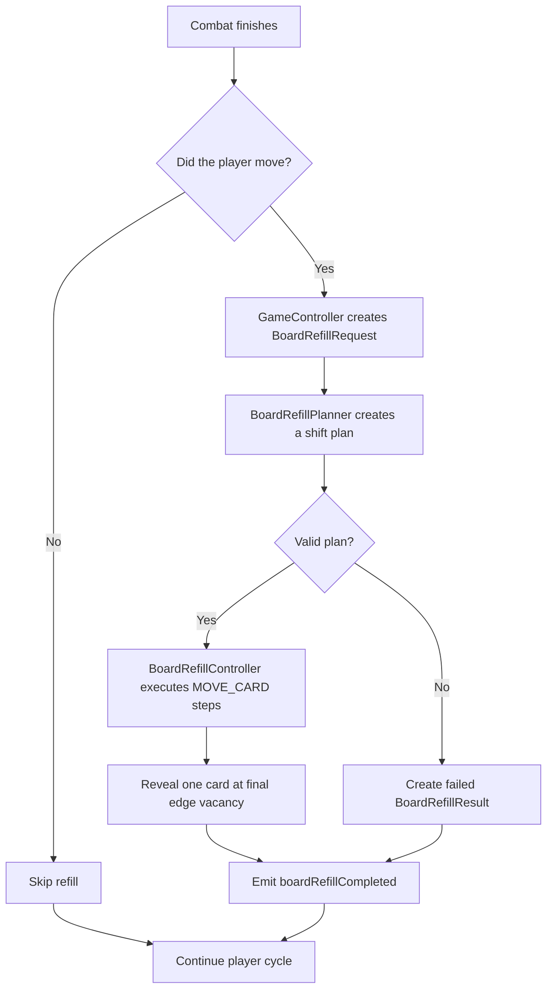
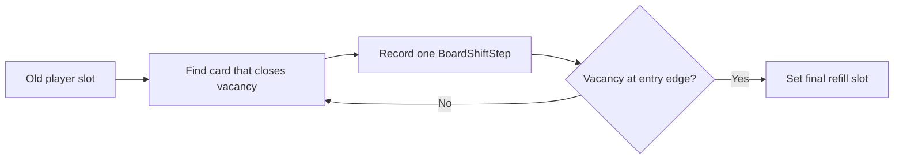
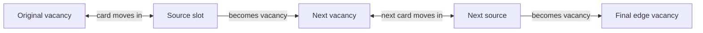
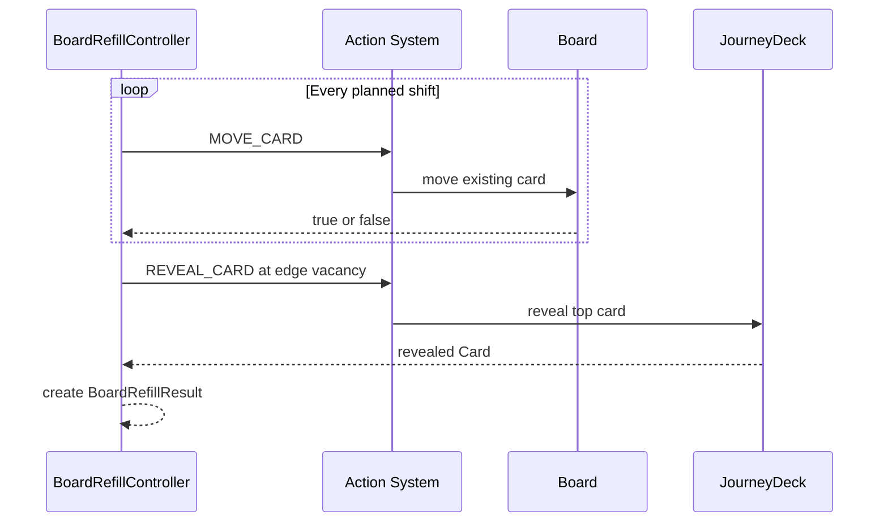
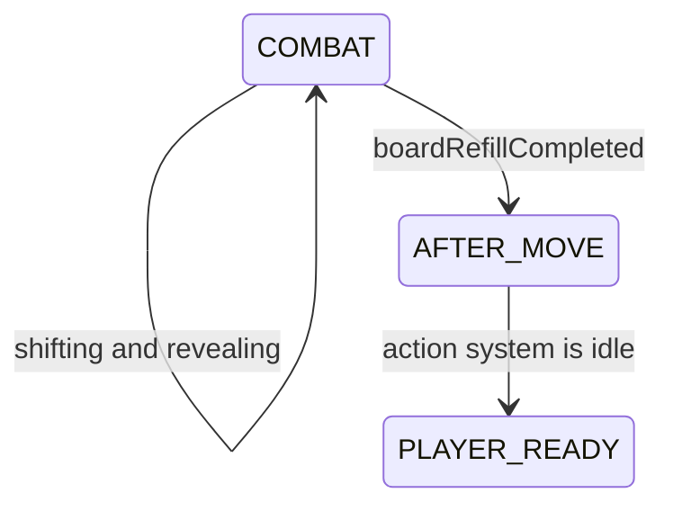

# Board Refill System

Related: [[Combat System]] · [[Action System]] · [[Story 13.5 Board Shift and Edge Refill Helper]]

## What It Does

The board refill system restores the Journey board after the player defeats a card and moves into its slot.

Combat leaves the player's previous slot empty. The refill system decides how existing cards should close that vacancy and where one new Journey card should enter.

Refill is separate from combat:

- Combat decides damage, death, and player movement.
- Board refill repairs the board afterward.
- GameController waits for both before completing the player cycle.

## Current and Planned Behavior

### Current Story 13 behavior

The current implementation reveals one new card directly into the slot the player left:

```text
[card] [empty] [player]
          ↓
[card]  [new]  [player]
```

This is a temporary working rule.

### Story 13.5 behavior

The real rule shifts existing cards into the vacancy. The vacancy travels through the board until it reaches the correct outer edge, where one new card enters:

```text
[card] [empty] [player]
   shift right →
[empty] [card] [player]
   reveal →
[new]   [card] [player]
```

This is called vacancy propagation.

## Main Flow



BoardRefillPlanner is part of Story 13.5. Until it is implemented, BoardRefillController uses the direct-slot rule.

## The Refill Request

BoardRefillRequest carries the information needed to refill the correct part of the board.

The current request contains:

| Field | Meaning |
|---|---|
| slot | The slot the player left |
| cycleNumber | The player cycle that caused the refill |
| cause | Why the refill was requested |

Story 13.5 will extend it with:

| Field | Meaning |
|---|---|
| vacatedPlayerSlot | Where the player was before combat |
| playerDestinationSlot | Where the player is now |
| movementDirection | Up, down, left, or right |
| cycleNumber | Protects against stale work |

Direction must be captured when movement happens. It should not be guessed later from mutable board state.

## Planning the Shift

BoardRefillPlanner will inspect the request and board without changing anything.

It returns a BoardShiftPlan containing:

- the original vacancy;
- the player's destination;
- the movement direction;
- an ordered list of existing-card movements;
- the final outer-edge refill slot;
- success or failure information.



Planning is side-effect free. If the planner cannot produce a valid route, no cards have moved yet.

## A Shift Step

Each BoardShiftStep describes one card movement:

```text
card
fromSlot
toSlot
```

The destination of the first step is the player's old slot. Each later step moves a card into the vacancy created by the previous step.



The player is never one of the shifted cards.

## The Four Golden Examples

These movements define the required Story 13.5 behavior.

### Player moves right

```text
[card] [empty] [player]  →  [empty] [card] [player]
refill: far-left
```

The row shifts right.

### Player moves down

```text
[card]       [empty]
[empty]  →  [card]
[player]     [player]
```

The column shifts down and the top slot is refilled.

### Player moves back up

```text
[card] [card] [empty]  →  [empty] [card] [card]
refill: bottom-left
```

The bottom row shifts right.

### Player moves left into the centre

```text
top-right card
      ↓
empty middle-right
```

The top-right card moves down and the top-right corner is refilled.

## Executing the Plan

BoardRefillController performs the plan through the [[Action System]]:



Every movement must succeed before the reveal is requested. A queued action being accepted is not enough; the returned result must also be checked.

## Empty Journey Deck

If the deck is empty:

1. Existing cards still perform their required shifts.
2. The final edge slot remains empty.
3. BoardRefillResult succeeds with skipped set to true.
4. GameController is still allowed to finish the cycle.
5. Story 15 decides whether an empty deck ends the run.

```text
shift board → reach edge vacancy → deck empty → leave vacancy open → finish refill
```

## Completing the Player Cycle



Input remains locked during refill. GameController unlocks it only after:

- boardRefillCompleted was emitted;
- ActionQueue is empty;
- ActionProcessor is idle;
- the cycle returns to PLAYER_READY.

A failed refill must still emit boardRefillCompleted so the game cannot remain permanently locked.

## Result

BoardRefillResult currently reports:

- the original request;
- success or failure;
- whether the reveal was skipped;
- the revealed card;
- a failure reason.

Story 13.5 will also report:

- the calculated BoardShiftPlan;
- which shift steps completed;
- the final edge vacancy.

This information belongs to BoardRefillResult, not CombatResult.

## Responsibility Summary

| Part | Responsibility |
|---|---|
| GameController | Requests refill and waits for completion |
| BoardRefillRequest | Describes the movement that caused the vacancy |
| BoardRefillPlanner | Calculates shifts without changing the board |
| BoardShiftPlan | Stores the ordered transformation |
| BoardRefillController | Executes movements and the final reveal |
| Action System | Performs each MOVE_CARD and REVEAL_CARD |
| JourneyDeck | Supplies the new card |
| BoardRefillResult | Reports the completed or failed operation |

## Important Rules

- Combat must finish before refill begins.
- The planner calculates; it does not mutate.
- Existing cards move before the new card is revealed.
- Every shift uses MOVE_CARD.
- The new card uses exactly one REVEAL_CARD.
- The player is never shifted by refill.
- Only the calculated path may change.
- Refill emits exactly one result.
- GameController waits for refill before completing the cycle.

## A Simple Mental Model

```text
Combat creates the hole.
The planner finds the route to the edge.
Existing cards pass the hole along that route.
The Journey Deck fills the final edge hole.
GameController then starts the next player cycle.
```
