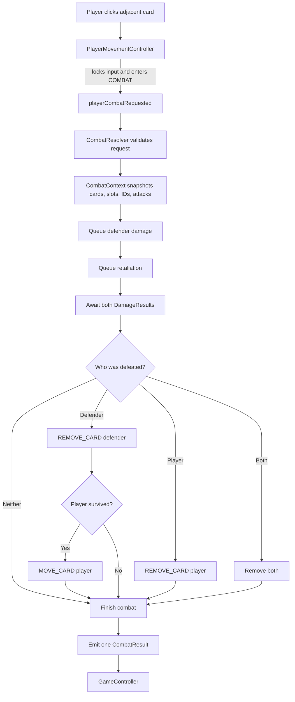
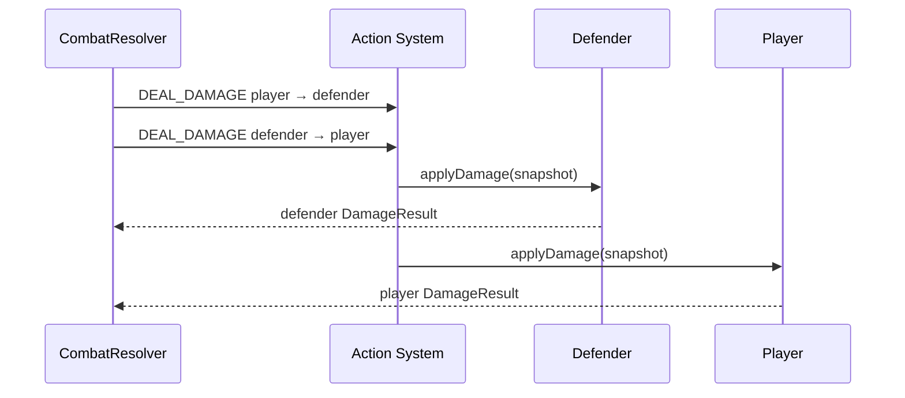
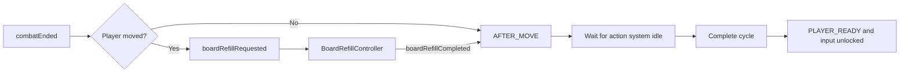

# Combat System

Related: [[Action System]] · [[Story 13 Combat and Board Refill Implementation Guide]] · [[Story 13.5 Board Shift and Edge Refill Helper]]

## What It Does

The combat system resolves one attack between the player and an occupied cardinal neighbour.

It validates the request, snapshots both attacks, deals both sides of damage through the [[Action System]], removes defeated cards, moves a surviving winner, and returns one typed CombatResult.

Combat does not draw the replacement Journey card itself.

## Complete Flow



## 1. Selecting a Target

PlayerMovementController accepts a target only when:

- the game is in PLAYER_READY;
- the target is a Card;
- it is not the player;
- both cards occupy board slots;
- the target is directly up, down, left, or right from the player.

Diagonal and empty targets are rejected.

For a valid target, GameController locks input and moves through:

```text
PLAYER_READY → RESOLVING_MOVE → COMBAT
```

PlayerMovementController then emits playerCombatRequested.

## 2. Validating and Snapshotting

CombatResolver validates the request again. This protects combat from stale or duplicate input.

It checks:

- all controller references exist;
- no combat is already resolving;
- GameController is still in COMBAT;
- the attacker is the authoritative player;
- the cycle number still matches;
- both cards still occupy the supplied slots;
- the slots are still cardinal neighbours.

CombatContext then snapshots:

| Snapshot | Why it is stored |
|---|---|
| Player and defender references | Immediate resolution |
| Original and target slots | Movement and refill |
| Stable instance and card IDs | Death attribution |
| Both attack values | Later changes cannot alter this combat |
| Cycle number | Reject stale work |

## 3. Both Sides Deal Damage

Combat creates two DEAL_DAMAGE actions:

1. Player damages defender.
2. Defender retaliates against player.

Both actions are validated before either is queued. This prevents half a combat from being scheduled.

Retaliation still happens when the defender receives lethal damage. Death is resolved only after both DamageResults return.



Temporary health absorbs damage before base health. Base health reaching zero is lethal.

## 4. Resolving Death

Defeated cards are removed with REMOVE_CARD actions.

Removal creates a GraveyardEntry and records the event in BoardHistory. Stable source instance IDs preserve attribution even during mutual death, when the first removed card may already have been freed before the second removal resolves.

| Outcome | Removal | Player movement |
|---|---|---|
| Both survive | None | No movement |
| Defender dies | Defender enters Graveyard | Player advances |
| Player dies | Player enters Graveyard | No movement |
| Both die | Both enter Graveyard | No movement |

Every required removal must succeed. A failed removal produces a failed CombatResult.

## 5. Moving the Player

The player advances only when:

- the defender was successfully removed; and
- the player survived.

Combat queues one MOVE_CARD action into the defender's former slot. Failed movement makes the whole combat result unsuccessful.

## 6. Completing Combat

CombatResolver emits exactly one combatEnded signal containing CombatResult.

CombatResult reports:

- whether combat succeeded;
- the CombatContext;
- both DamageResults;
- who was defeated;
- Graveyard entries;
- whether the player moved;
- a failure reason when necessary.

It deliberately contains no Journey Deck or replacement-card data.

## 7. Refill and Player-Cycle Completion



Currently, BoardRefillController reveals one card into the slot the player left. [[Story 13.5 Board Shift and Edge Refill Helper]] replaces that temporary rule with proper board shifting and edge refill.

A refill failure still sends boardRefillCompleted, allowing GameController to settle the cycle safely instead of leaving input locked.

## Failure Rules

Combat fails if:

- its request is stale or invalid;
- damage cannot be scheduled or returns a failed result;
- a required card removal fails;
- required player movement fails.

Invalid requests are ignored before combat starts. Failures after resolution begins emit a typed failed CombatResult.

## A Simple Mental Model

```text
PlayerMovementController = decides whether a click may request combat
CombatContext            = frozen facts for this combat
CombatResolver           = coordinates the combat sequence
Action System            = performs damage, removal, and movement
CombatResult             = authoritative report of what happened
GameController           = continues refill and the player cycle
```

Combat coordinates operations; it does not bypass their owning systems.
